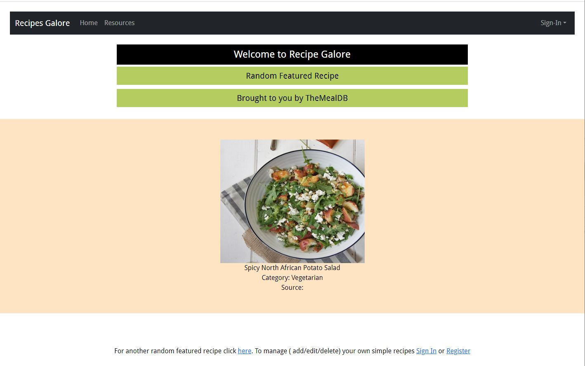
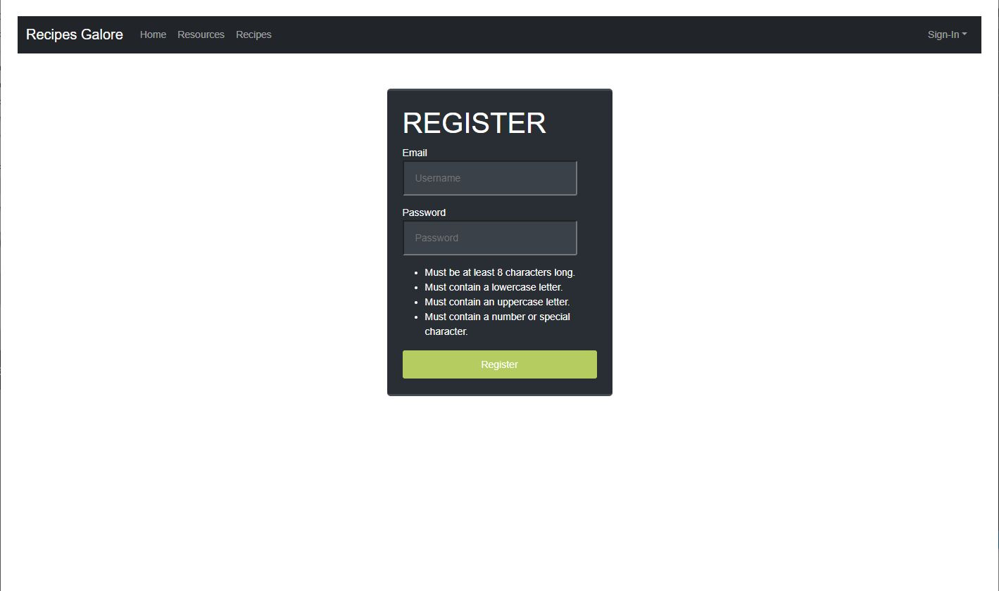
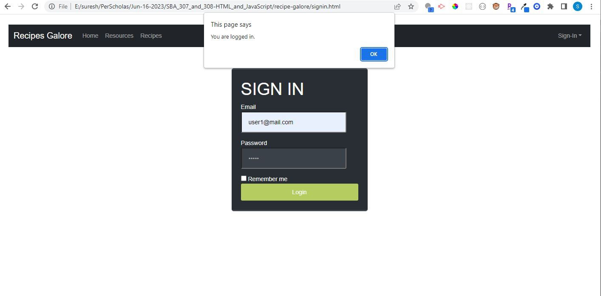
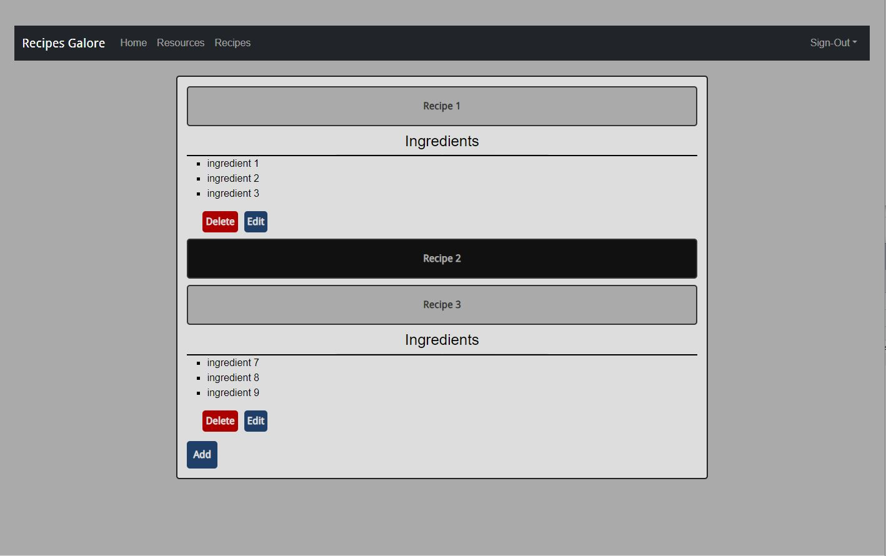
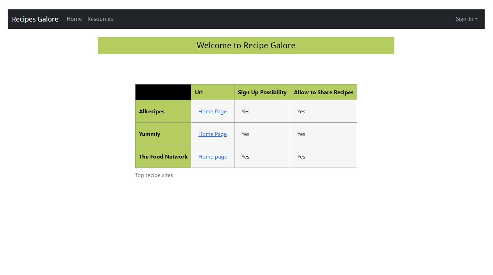

# recipe-galore

#### Sample screen shots

## Table of Contents

- [Description](#Description)

- [Installation](#Installation)

- [Instructions](#Instructions)

- [License](#License)

- [Contribute](#Contribute)

- [Tests](#Tests)

- [Questions](#Questions)

- [Improvements](#Improvements)

## Description

This website is an entry level  recipe website. It generates a random recipe using MealDB API any time index.html is loaded. It has login and register functionality. Once on sign in, one can store simple text based recipes / notes for future  reference. It has user authentication done using local storage. Also the simple recipe is stored as an array in local storage.

## Installation

N/A

## Instructions

Simple to navigate.  SignIn/Register to access recipes section to add/edit/delete simple recipes.

## License

This project is licensed under the [ISC](https://opensource.org/licenses/ISC) License.

## Contribute

Please use my e-mail to contact me on how to contribute to this project.

## Tests

There are no automated tests written for this app. However it is easy to launch the app and answer the questions, at the end README.md will get generated.

## Questions

https://github.com/s-suresh-kumar
suresh01@yahoo.com

## Improvements

Recipes nav link is currently visible while trying to sign-in / register. In the future version, recipes menu link will only be available upon successful sign in. Also the recipe page is not auto loading on sign-in / register, which will be fixed in next iteration.
